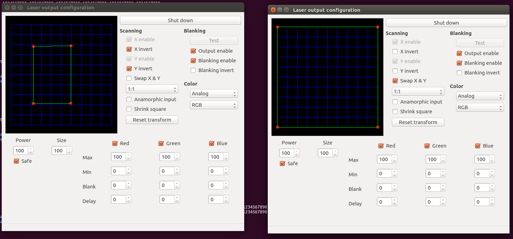

Laser-Writer
************

Installation
============

Venv
++++
| 1. You will need to install venv ``pip install virtualenv --user`` or ``sudo apt-get install python-virtualenv``
| 2. Then activate venv before working on the project ``source venv/bin/activate``
| *Note:* Venv makes managing the python dependancies much easier. Flask offers a good explanation of venv here: http://flask.pocoo.org/docs/0.11/installation/

Twitter
+++++++
If you need to setup your own Twitter API tokens, follow the instructions here: http://socialmedia-class.org/twittertutorial.html
If the twtter librars is not recognized you can reinstall it with the following:
1. ``cd twitter_functions/twitter-1.17.1/``
2. ``python setup.py build``
3. ``python setup.py install``
4. Verify with ``pip freeze | grep twitter``

Openlase
++++++++
| Follow the instructions here: https://github.com/marcan/openlase/wiki/Installation
| *Note:* This for reference only because I should be including all the compiled files in the project. 

qjackctl
++++++++
1. Install with ``sudo apt-get -y install qjackctl``
2. load defaults file `` ``
3. load patchbay defaults file ``Dual_Lasershark_0.xml``

More instructions here: https://github.com/marcan/openlase/wiki/JACK_and_Openlase_Configuration

Usage
=====
1. Run ``./start_ol_services`` This will start all of the openlase and jack utilities (output control, jack, simulator, lasershark_jack)
2. Enter the venv enviroment: ``source venv/bin/activate``
3. Run the main.py file ``python main.py``
4. You might need to click the patchbay button in JACK and activate all the connections (see the jack tutorial for setting up the connections)
5. Multiple windows will be open. The output controls must be configured similar to the below image to blend the two lasers together.

Documentation:
=================
| The documentation managed through sphinx. 
| The documentation is hosted with github pages.
| The documentations is available `here <https://malcolmwilliams.github.io/Laser-Writer/>`_

To update/push documentation changes:
+++++++++++++++++++++++++++++++++++++
1. Make changes to docstrings in code
2. Navigate to docs directory
3. Generate new html with: ``make html`` (make sure you have activated ``venv``)
4. Add the changes: ``git add .``
5. Commit the changes: ``git commit -m "this is an example commit"``
6. Push the changes to the github pages branch: ``git subtree push --prefix docs/_build/html origin gh-pages``
*Note:* an alias can be made in your gitconfig file if you are lazy

Lasershark protocol
===================
| *Note:* This is largely obselete because the lasershark libraries have been replaced with the openlase libraries.
| ``r=1000 # THIS MUST BE THE FIRST LINE IN THE FILE!``
The "r=number" command sets the speed in points per second (pps) at which samples are displayed by the Lasershark. 
The pps speed can be set to any integer between 1 and the maximum value as reported by the Lasershark (64000)   
You should not set this value to be greater than what your galvos are capable of operating at.
Failure to adhere to this guidance can result in galvo damage or decreased lifespan.

| ``e=1``
The "e=" command sets the output enable state of the Lasershark. The output enable status must be set for any
laser or galvo control to occur. *Note:* ``e=1 #enable`` and ``e=0 #disable``

| ``p=""``
Prints a text string to the console

| ``s=1,1,1,1,1,1``
The "s=" command adds a sample to the sample buffer to be written out to the Lasershark.
A sample defines galvo positioning and laser intensity for a particular point to be displayed. 
The format is "s=X,Y,A,B,C,INTL_A"
The ranges for these fields are X=[0-4095],Y=[0-4095],A=[0-4095],B=[0-4095],C=[0,1],INTL_A=[0,1]
For A and B (analog laser control outputs), 0 means the output is off and 4096 means the output is at full power
1024 would indicate 25% output power, 2048 would indicate 50% output power, etc.
For C (TTL laser control output) 0 means the output is off and 1 means the output is on
For INTL_A (Interlock A) 0 means the output is off and 1 means the output is on (for ttl)
Samples are queued until they fill a full lasershark packet and are then written out to the lasershark.
This means that to ensure ALL samples are written out, a flush should be performed once all desired samples are 
written out.

| ``f=1``
Flushes all samples. It is reccomended to stick this at the end of your output file to ensure all samples are displayed. 
